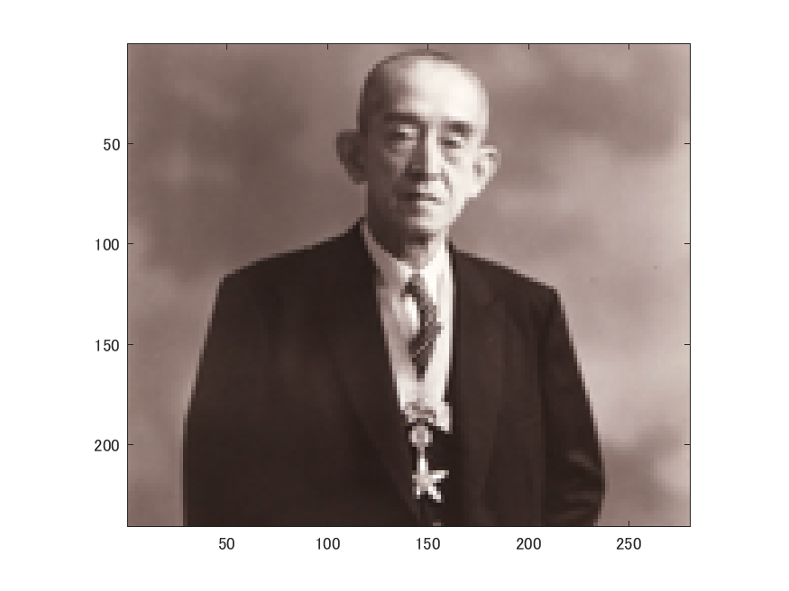
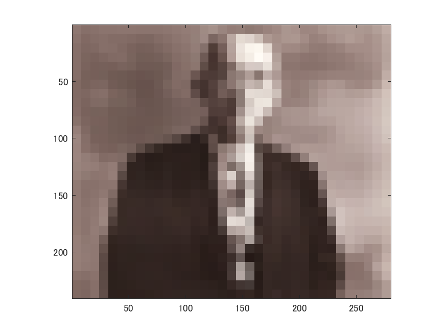
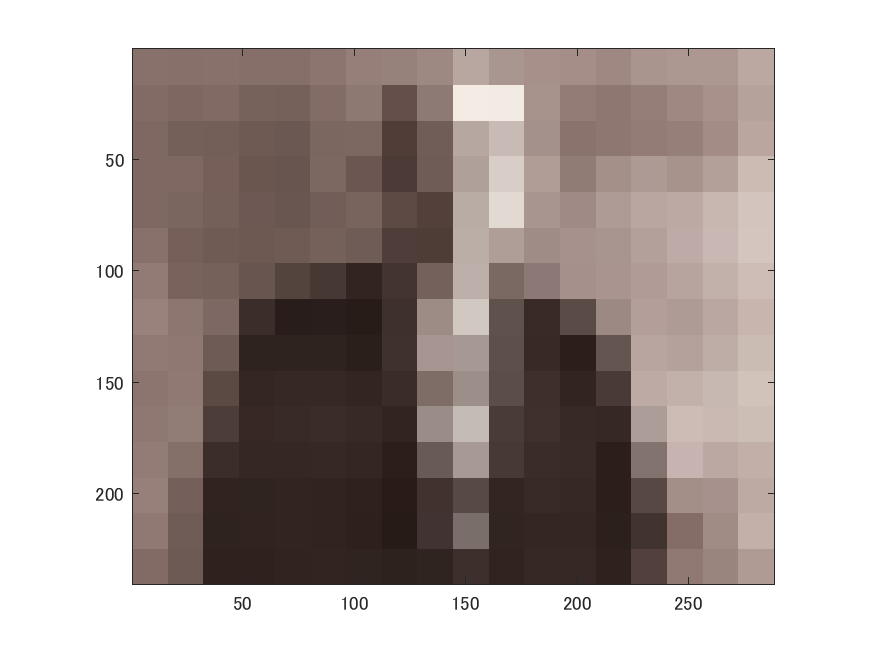

# 課題１　標本化間隔と空間解像度　レポート

これは画像をダウンサンプリングして表示するプログラムである．

以下のコマンドimreadにより、280x240の解像度の画像を読み込む。
ORG=imread('http://web.dendai.ac.jp/albums/abm00000476.jpg');
imagesc(ORG); axis image; % 画像の表示
pause; % 一時停止

読み込んだ画像は以下の図１の通り。

図１　原画像

以下コマンドを用いて、原画像を2分の1にサンプリングするため、画像を縦横それぞれ2分の1の解像度に縮小後、それぞれ2倍して原画像サイズに戻す。
また、MATLABの単純補間を行うため、「box」コマンドを付加する。
IMG = imresize(ORG,0.5); % 画像の縮小
IMG2 = imresize(IMG,2,'box'); % 画像の拡大
imagesc(IMG2); axis image; % 画像の表示
pause; % 一時停止

これらを繰り返し、imresizeで図１のサイズに戻す操作を繰り返した結果が図２〜図５となる。

 2分の1サンプリングは図２の通り。

図２　 2分の1サンプリング

 4分の1サンプリングは図３の通り。

図３　 4分の1サンプリング

 8分の1サンプリングは図４の通り。

図４　 8分の1サンプリング

16分の1サンプリングは図４の通り。

図４　16分の1サンプリング

