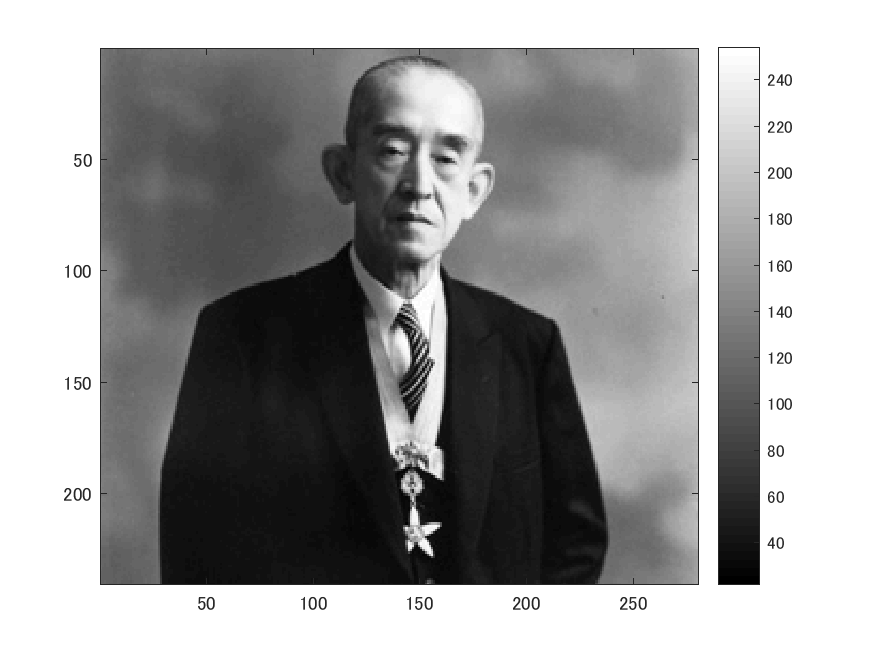
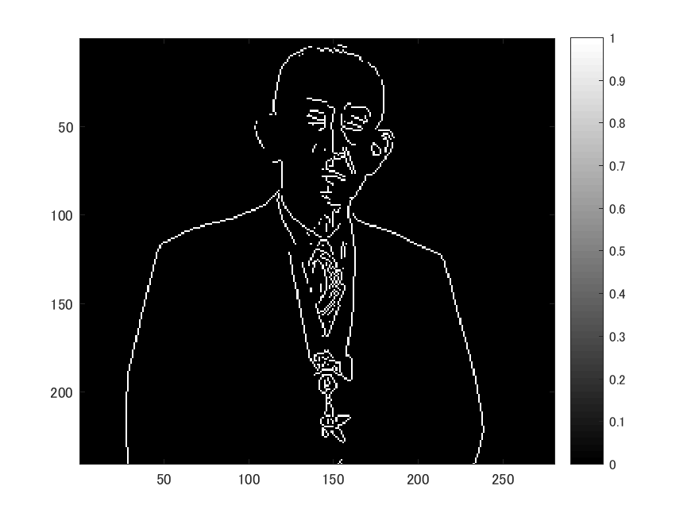
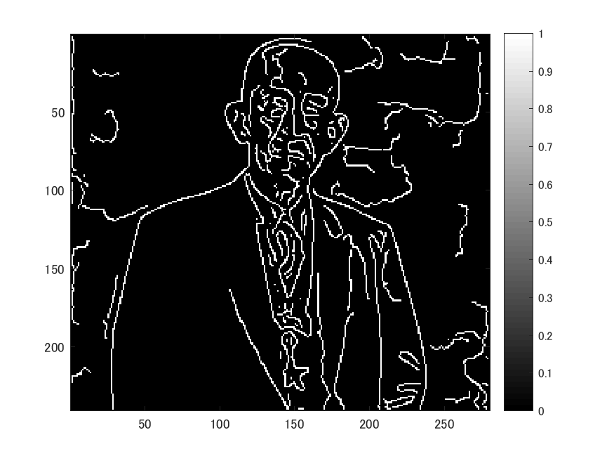

# 課題10 画像のエッジ抽出 

下記のプログラムはエッジ抽出するプログラムである。

以下のコマンドimreadにより、280x240の解像度の画像を読み込み、rgb2grayコマンドを用いて白黒画像にする。
ORG = imread('http://web.dendai.ac.jp/albums/abm00000476.jpg'); % 原画像の入力
ORG = rgb2gray(ORG); %カラーからグレイへの変換
imagesc(ORG); colormap('gray'); colorbar;% 画像表示
pause; % 一時停止

読み込んで白黒にした画像は以下の図１の通り。

図１　原画像

原画像をプレウィット法でエッジ抽出する。結果は図２。
IMG = edge(ORG,'prewitt'); % エッジ抽出（プレウィット法）
imagesc(IMG); colormap('gray'); colorbar;% 画像表示
saveas(gcf,'kadaia-2.png');
pause; % 一時停止

図２　プレウィット法でエッジ抽出の結果

原画像をソベル法でエッジ抽出する。結果は図３。
IMG = edge(ORG,'sobel'); % エッジ抽出（ソベル法）
imagesc(IMG); colormap('gray'); colorbar;% 画像表示
saveas(gcf,'kadaia-3.png');
pause; % 一時停止

図３　ソベル法でエッジ抽出の結果

原画像をキャニー法でエッジ抽出する。結果は図３。
IMG = edge(ORG,'canny'); % エッジ抽出（キャニー法）
imagesc(IMG); colormap('gray'); colorbar;% 画像表示
saveas(gcf,'kadaia-4.png');
pause; % 一時停止

図４　キャニー法でエッジ抽出の結果

