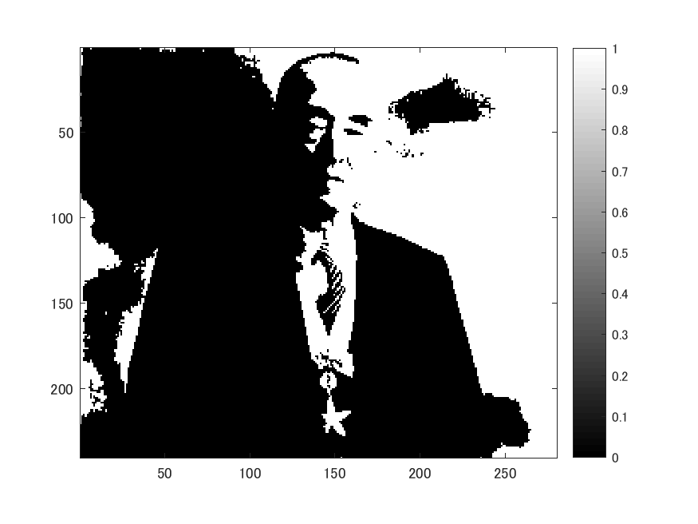
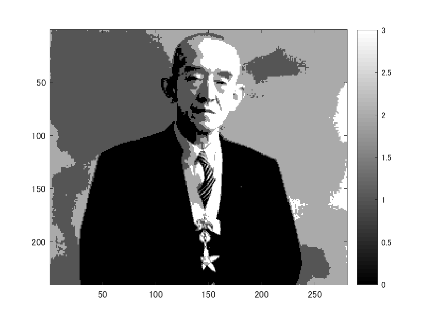

# 課題２　階調数と疑似輪郭　レポート

これは２階調，４階調，８階調の画像を生成するプログラムである。  
以下のコマンドimreadにより、280x240の解像度の画像を読み込み、rgb2grayコマンドを用いて白黒画像にする。  

ORG=imread('http://web.dendai.ac.jp/albums/abm00000476.jpg'); % 原画像の入力  
ORG = rgb2gray(ORG); colormap(gray); colorbar; % カラーバーの表示  
imagesc(ORG); axis image; % 画像の表示  
pause; % 一時停止  

読み込んで白黒にした画像は以下の図１の通り。  

図１　原画像

以下のように255段階の白黒画像の２階調画像の生成するため、各ドットの色が白に近いか黒に近いかでそれぞれ白黒つける。  

IMG = ORG>128;  
imagesc(IMG); colormap(gray); colorbar;  axis image;  
pause;  

同様に、４階調画像の生成を行う。  

IMG0 = ORG>64;  
IMG1 = ORG>128;  
IMG2 = ORG>192;  
IMG = IMG0 + IMG1 + IMG2;  
imagesc(IMG); colormap(gray); colorbar;  axis image;  

同様に、８階調画像の生成を行う。  

IMG0 = ORG>32;  
IMG1 = ORG>64;  
IMG2 = ORG>96;  
IMG3 = ORG>128;  
IMG4 = ORG>160;  
IMG5 = ORG>192;  
IMG6 = ORG>224;  
IMG = IMG0 + IMG1 + IMG2 + IMG3 + IMG4 + IMG5 + IMG6;  
imagesc(IMG); colormap(gray); colorbar;  axis image;  

これらの結果が図２～図４となる。  

 ２階調は図２の通り。  

図２　 ２階調の画像

 ４階調は図３の通り。

図３　 ４階調の画像

 ８階調は図４の通り。

図４　 ８階調の画像
