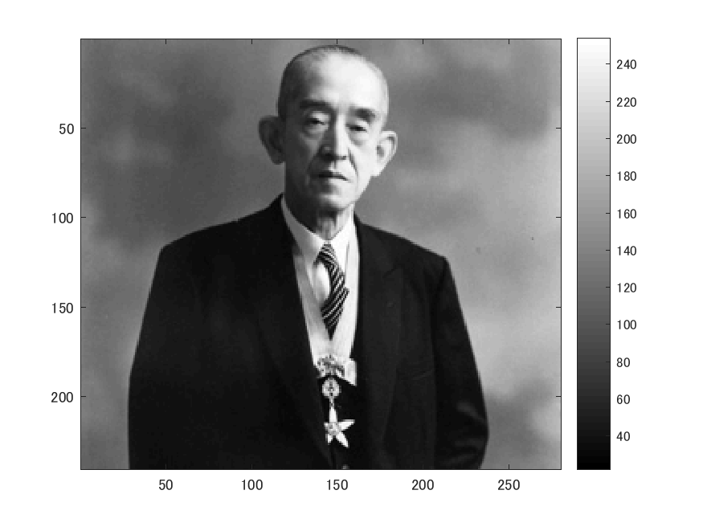
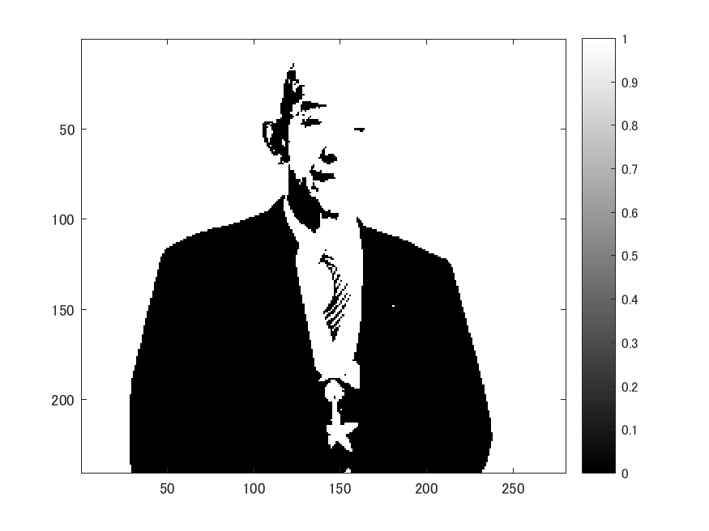
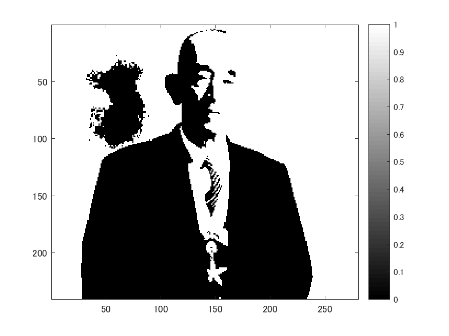
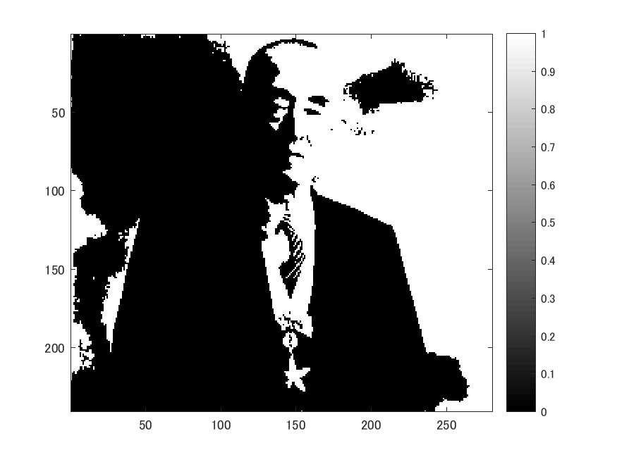
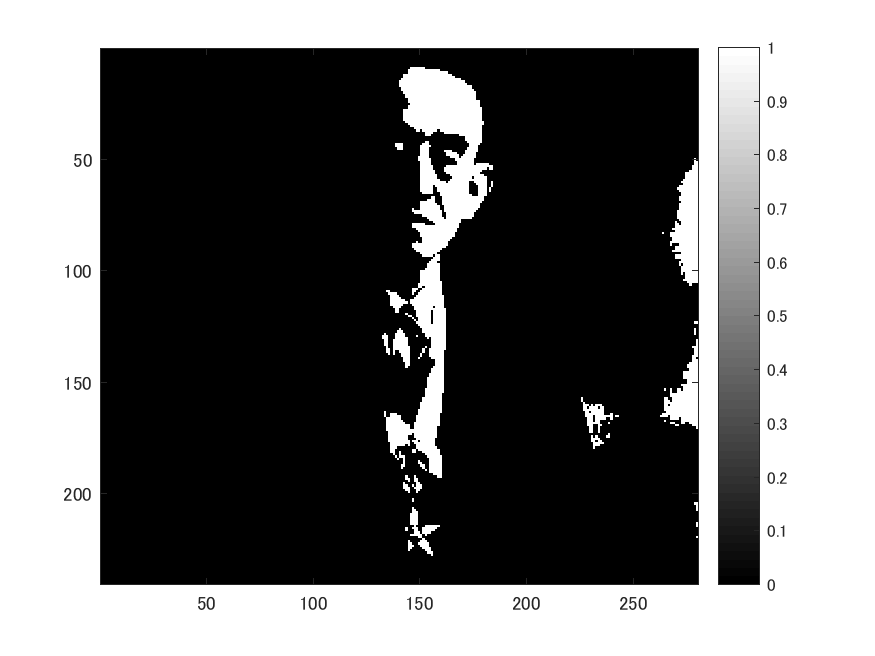

# 課題３　閾値処理　レポート

これは閾値を4パターン設定して閾値処理をした画像の生成プログラムである。
以下のコマンドimreadにより、280x240の解像度の画像を読み込み、rgb2grayコマンドを用いて白黒画像にする。

ORG=imread('http://web.dendai.ac.jp/albums/abm00000476.jpg'); % 原画像の入力
ORG= rgb2gray(ORG);
imagesc(ORG); colormap(gray); colorbar; % 画像の表示
pause;

読み込んで白黒にした画像は以下の図１の通り。

図１　原画像

輝度値が64以上の画素を1へ、その他を0に変換する
IMG = ORG > 64;
imagesc(IMG); colormap(gray); colorbar;
pause;

輝度値が96以上の画素を1へ、その他を0に変換する

IMG = ORG > 96;
imagesc(IMG); colormap(gray); colorbar;
pause;

上記のように、これらを繰り返し、輝度値がそれぞれ64以上、96以上、128以上、192以上の結果が図２〜図５となる。

 輝度値 64以上は図２の通り。

図２　 輝度値 64以上

 輝度値 96以上は図３の通り。

図３　 輝度値 96以上

 輝度値128以上は図４の通り。

図４　 輝度値128以上

 輝度値192以上は図５の通り。

図５　 輝度値192以上

