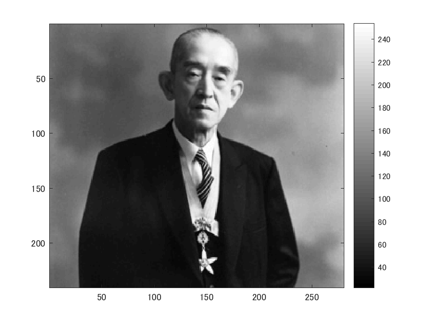
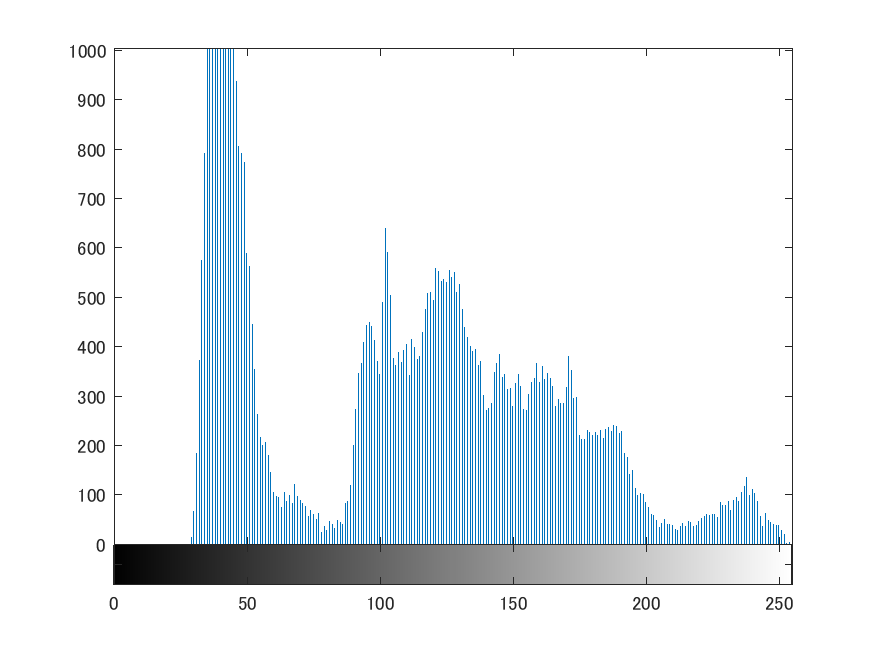

# 課題４　画像のヒストグラム

これは画素の濃度ヒストグラムを生成するプログラムである。

以下のコマンドimreadにより、280x240の解像度の画像を読み込み、rgb2grayコマンドを用いて白黒画像にする。
ORG=imread('http://web.dendai.ac.jp/albums/abm00000476.jpg'); % 原画像の入力
ORG=rgb2gray(ORG); % カラー画像を白黒濃淡画像へ変換
imagesc(ORG); colormap(gray); colorbar;
pause;

読み込んで白黒にした画像は以下の図１の通り。

図１　原画像

以下のコマンドimhistにより、ヒストグラムを生成する。
imhist(ORG); % ヒストグラムの表示

生成したヒストグラムは以下の図２の通り。

図２　ヒストグラム

