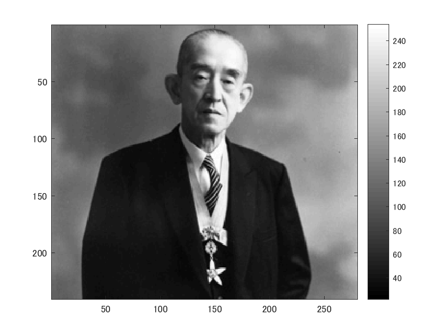
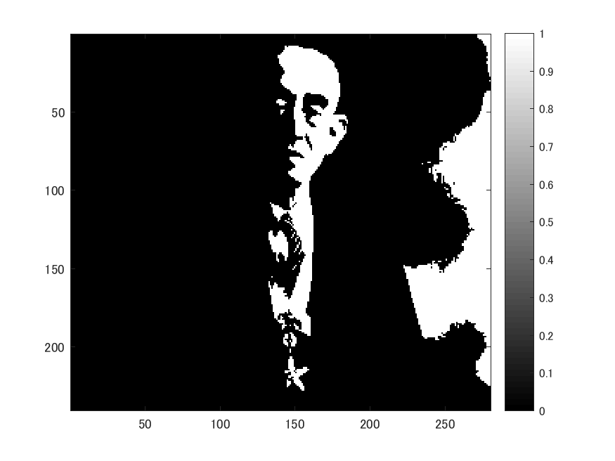

# 課題５　判別分析法

これは判別分析法を用いて画像を二値化するプログラムである。
以下のコマンドimreadにより、280x240の解像度の画像を読み込み、rgb2grayコマンドを用いて白黒画像にする。

ORG=imread('http://web.dendai.ac.jp/albums/abm00000476.jpg'); % 原画像の入力
ORG = rgb2gray(ORG); % カラー画像を白黒濃淡画像へ変換
imagesc(ORG); colormap(gray); colorbar;
pause;

読み込んで白黒にした画像は以下の図１の通り。

図１　原画像

判別分析法は大津の二値化とも言われ、分離度が最大となるしきい値を求め、自動的に二値化を行う手法。[1]

ヒストグラムのデータを列ベクトルに格納する

H = imhist(ORG);
myu_T = mean(H);
max_val = 0;
max_thres = 1;
for i=1:255

ヒストグラムを2つのクラスに分ける

C1 = H(1:i);
C2 = H(i+1:256);

n1 = sum(C1); %画素数の算出
n2 = sum(C2);
myu1 = mean(C1); %平均値の算出
myu2 = mean(C2);
sigma1 = var(C1); %分散の算出
sigma2 = var(C2);
sigma_w = (n1 *sigma1+n2*sigma2)/(n1+n2); %クラス内分散の算出
sigma_B = (n1 *(myu1-myu_T)^2+n2*(myu2-myu_T)^2)/(n1+n2); %クラス間分散の算出
if max_val<sigma_B/sigma_w
max_val = sigma_B/sigma_w;
max_thres =i;
end;
end;

IMG = ORG > max_thres;
imagesc(IMG); colormap(gray); colorbar;
pause;

判別分析法で２値化した画像は図２。

図２　判別分析法で２値化した画像

# 参考文献

[1]　判別分析法（大津の２値化）　画像処理ソリューション
http://imagingsolution.blog107.fc2.com/blog-entry-113.html
