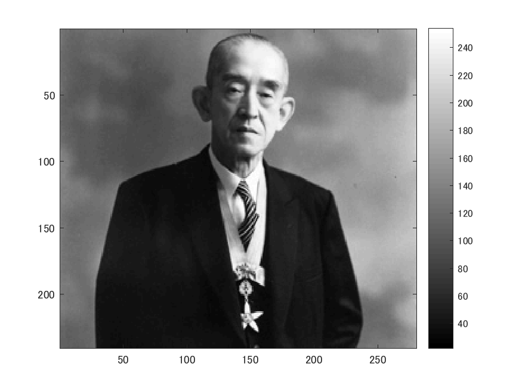
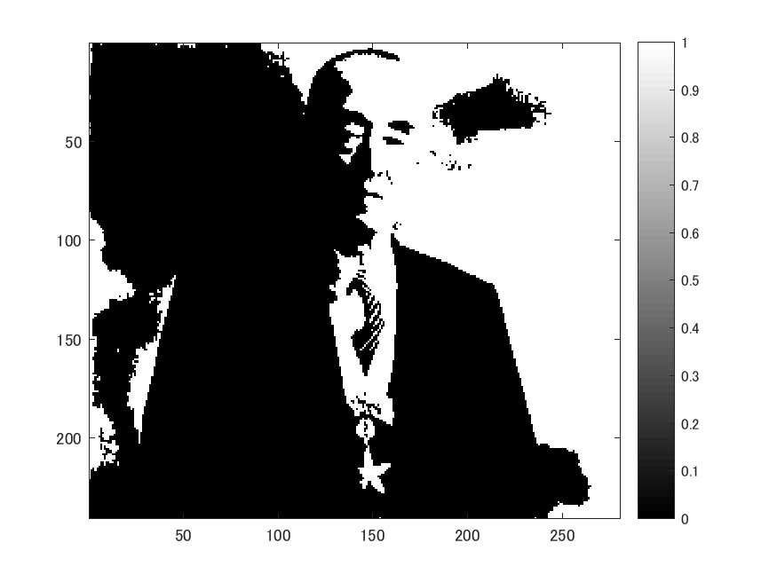

# 課題６　画像の二値化
  
下記のプログラムは画像を二値化するプログラムである。  
以下のコマンドimreadにより、280x240の解像度の画像を読み込み、rgb2grayコマンドを用いて白黒画像にする。  
  
ORG=imread('http://web.dendai.ac.jp/albums/abm00000476.jpg'); % 原画像の入力  
ORG = rgb2gray(ORG);  
imagesc(ORG); colormap(gray); colorbar; % 画像の表示  
pause; % 一時停止  
  
読み込んで白黒にした画像は以下の図１の通り。  

図１　原画像  
  
  
  
輝度値が128以上の画素を1へ、その他を0に変換する。結果は図２。  
  
IMG = ORG>128;  
imagesc(IMG); colormap(gray); colorbar; % 画像の表示  
pause;  
  

図２　 輝度値128以上による閾値処理結果  
  
  
以下のコマンドditherを用いて、ディザ法による２値化を行う。結果は図３。  
  
IMG = dither(ORG);   
imagesc(IMG); colormap(gray); colorbar; % 画像の表示  

図２　 ディザ法による２値化結果  

