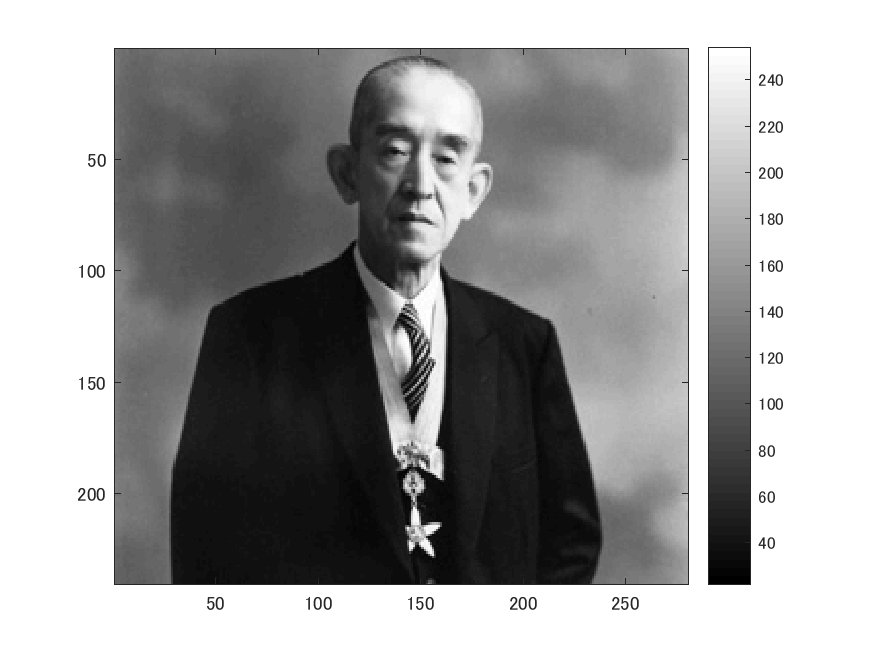
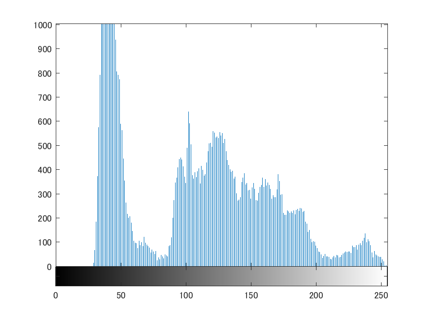
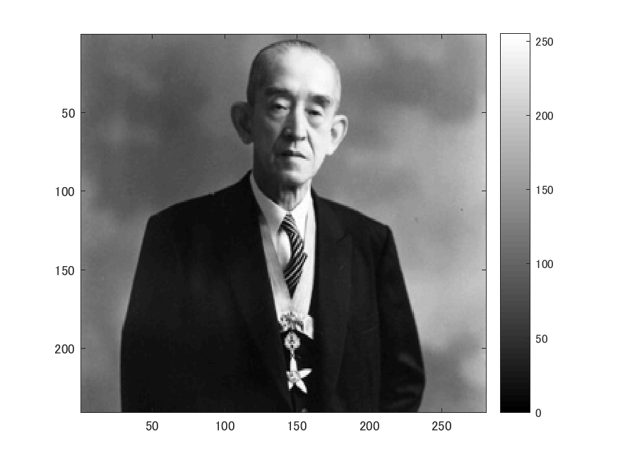
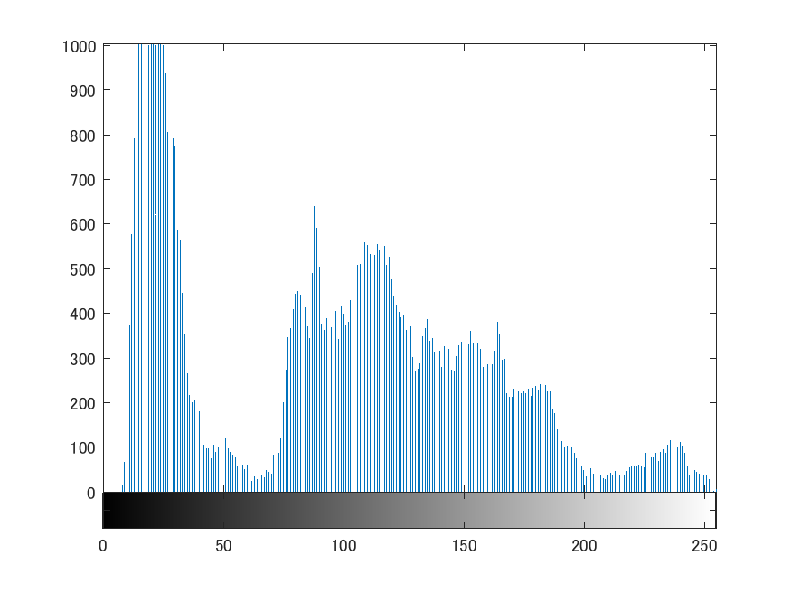

# 課題7　ダイナミックレンジの拡大

下記のプログラムは画素のダイナミックレンジを０から２５５にするプログラムである。
以下のコマンドimreadにより、280x240の解像度の画像を読み込み、rgb2grayコマンドを用いて白黒画像にする。

ORG = imread('http://web.dendai.ac.jp/albums/abm00000476.jpg'); % 画像の読み込み
ORG = rgb2gray(ORG); % 白黒濃淡画像に変換
imagesc(ORG); colormap(gray); colorbar; % 画像の表示
pause;

読み込んで白黒にした画像は以下の図１の通り。

図１　原画像

以下のコマンドimhistにより、ヒストグラムを生成する。

imhist(ORG); % 濃度ヒストグラムを生成、表示
pause;

生成したヒストグラムは以下の図２の通り。

図２　ヒストグラム

全体のビットの最小値を探し、各ビットから最小値を引き、それらを全体的に０から２５５になるようにする。

ORG = double(ORG);
mn = min(ORG(:)); % 濃度値の最小値を算出
mx = max(ORG(:)); % 濃度値の最大値を算出
ORG = (ORG-mn)/(mx-mn)*255;
imagesc(ORG); colormap(gray); colorbar; % 画像の表示
pause;

生成した画像は以下の図３の通り。

図３　ダイナミックレンジを拡大した画像

ORG = uint8(ORG); % ０から２の８乗から１引いた値、つまり２５５までの整数の絶対値への変換
imhist(ORG); % 濃度ヒストグラムを生成、表示

生成したヒストグラムは以下の図２の通り。

図２　ダイナミックレンジを拡大した画像のヒストグラム
