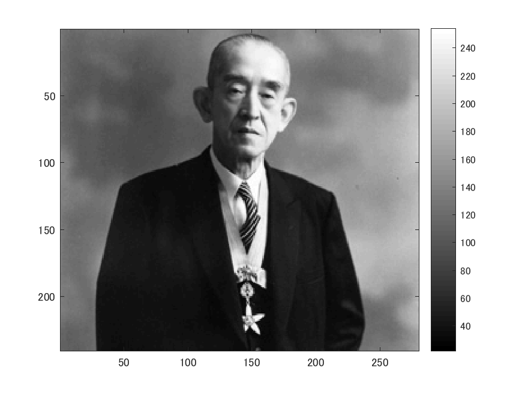
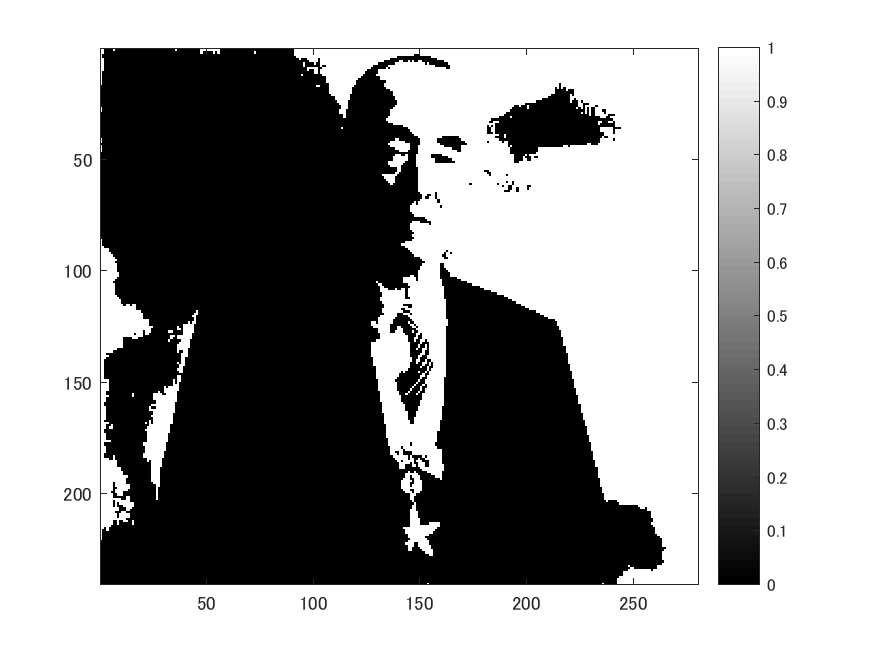
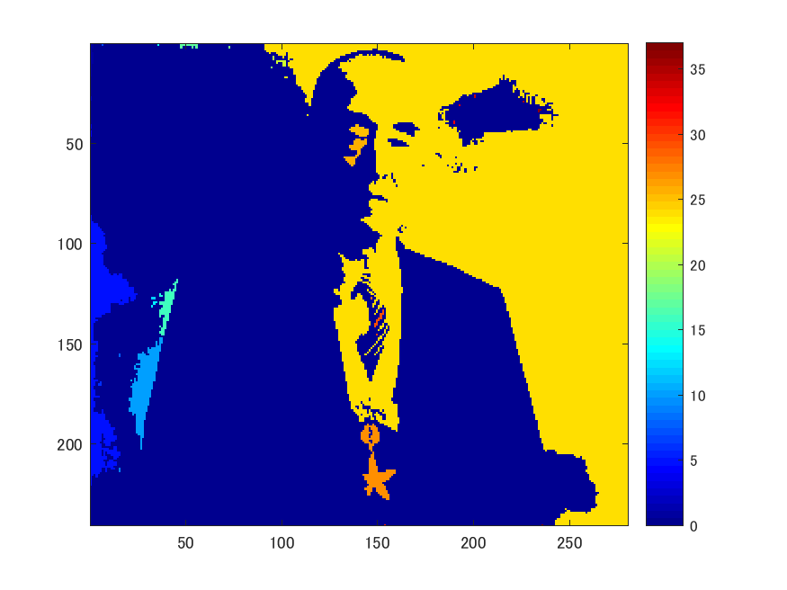

# 課題８ ラベリング

下記のプログラムは二値化された画像の連結成分にラベルをつけるプログラムである。
以下のコマンドimreadにより、280x240の解像度の画像を読み込み、rgb2grayコマンドを用いて白黒画像にする。

ORG = imread('http://web.dendai.ac.jp/albums/abm00000476.jpg'); % 画像の読み込み
ORG = rgb2gray(ORG); % 白黒濃淡画像に変換
imagesc(ORG); colormap(gray); colorbar; % 画像の表示
pause;

読み込んで白黒にした画像は以下の図１の通り。

図１　原画像

輝度値が128以上の画素を1へ、その他を0に変換する。結果は図２。

IMG = ORG > 128;
imagesc(IMG); colormap(gray); colorbar; % 画像の表示
pause;

図２　 輝度値128以上による閾値処理結果

以下のコマンドbwlabelnを用いて、画像内のオブジェクトのラベリングを行う。画像はラベルごとに色分けされる。[1]

IMG = bwlabeln(IMG);
imagesc(IMG); colormap(jet); colorbar; % 画像の表示
pause;

図３　 オブジェクトのラベリング結果

# 参考文献
バイナリイメージ内のオブジェクトのラベル付けと測定
http://jp.mathworks.com/help/images/labeling-and-measuring-objects-in-a-binary-image.html
