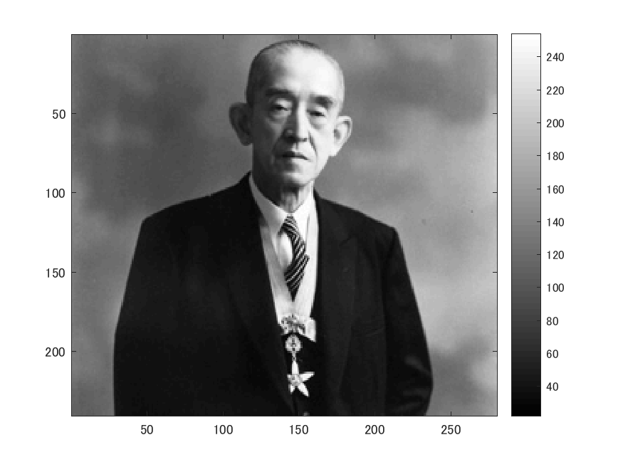
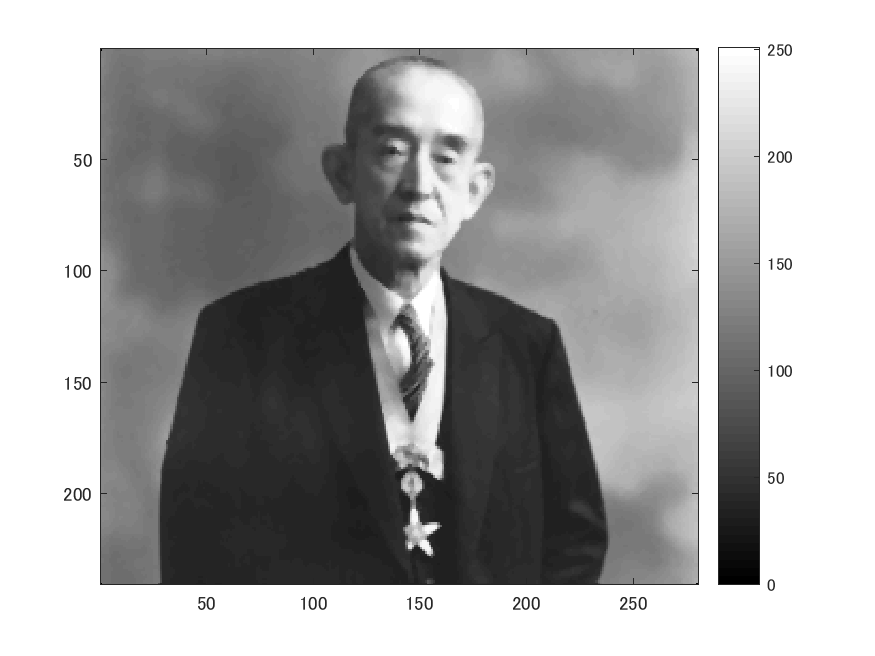
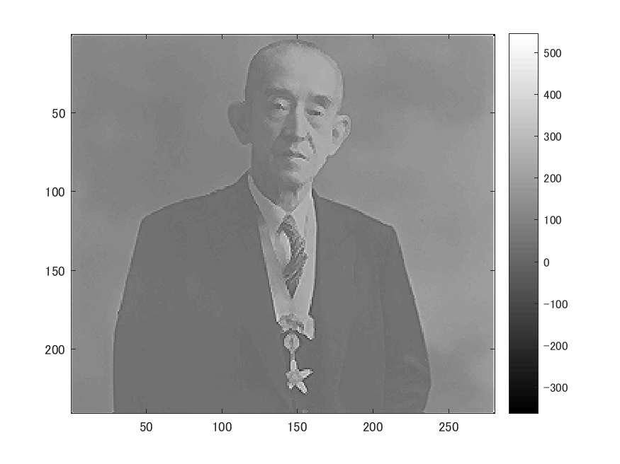

# 課題９ メディアンフィルタと先鋭化
  
下記のプログラムはメディアンフィルターを適用してノイズ除去を行うプログラム。  
以下のコマンドimreadにより、280x240の解像度の画像を読み込み、rgb2grayコマンドを用いて白黒画像にする。  
  
ORG = imread('http://web.dendai.ac.jp/albums/abm00000476.jpg'); % 画像の読み込み  
ORG = rgb2gray(ORG); % 白黒濃淡画像に変換  
imagesc(ORG); colormap(gray); colorbar; % 画像の表示  
pause;  
  
読み込んで白黒にした画像は以下の図１の通り。  

図１　原画像  
  
  
  
MATLABのイメージにノイズを付加するコマンドimnoiseを用いて、typeが「salt & pepper」のノイズを添付。結果は図２。  
ORG = imnoise(ORG,'salt & pepper',0.02); % ノイズ添付  
imagesc(ORG); colormap(gray); colorbar; % 画像の表示  
pause;  

図２　salt & pepper  
  
  
  
  
図２のノイズを平滑化フィルタで雑音除去  
IMG = filter2(fspecial('average',3),ORG); % 平滑化フィルタで雑音除去  
imagesc(IMG); colormap(gray); colorbar; % 画像の表示  
pause;  

図３　平滑化フィルタで雑音除去した結果  
  
  
  
  
図３のノイズをメディアンフィルタで雑音除去  
  
IMG = medfilt2(ORG,[3 3]); % メディアンフィルタで雑音除去  
imagesc(IMG); colormap(gray); colorbar; % 画像の表示  
pause;  

図４　メディアンフィルタで雑音除去した結果  
  
  
  
  
図４のノイズにフィルターを適用  
  
f=[0,-1,0;-1,5,-1;0,-1,0]; % フィルタの設計  
IMG = filter2(f,IMG,'same'); % フィルタの適用  
imagesc(IMG); colormap(gray); colorbar; % 画像の表示  
pause;  

図５　メディアンフィルタで雑音除去した結果  

